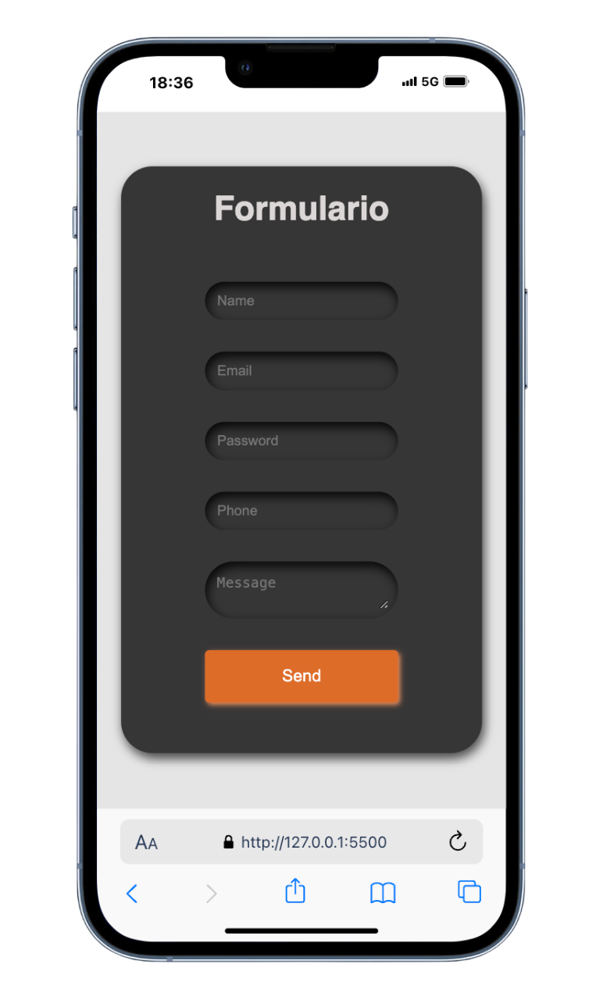
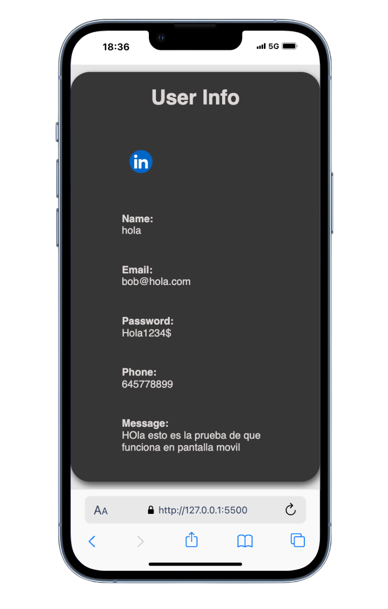

# Proyecto Formulario

Este proyecto implementa una interfaz de formulario dinámica donde los datos ingresados por el usuario se validan y se muestran en una tarjeta de información. El diseño es completamente responsivo y está estilizado utilizando SCSS (Sass).

## Características
- Validación dinámica del formulario con manejo de errores en tiempo real.
- Transiciones animadas entre la tarjeta del formulario y la tarjeta de información.
- Diseño responsivo que se adapta a diferentes tamaños de pantalla.
- Los errores se muestran dinámicamente dentro de la tarjeta del formulario.

## Tecnologías Utilizadas
- HTML5
- CSS3
- SCSS (Sass)
- JavaScript (Vanilla)

## Imagenes del diseño en móviles



## Cómo Ejecutar el Proyecto
1. Clona el repositorio:
   ```bash
   git clone https://github.com/tu-usuario/Formulario-Metric.git
   ```

2. Navega al directorio del proyecto:
   ```bash
   cd Formulario-Metric
   ```

3. Abre el archivo `index.html` en tu navegador para visualizar el proyecto.

## Configuración para Desarrollo
Para modificar los estilos en SCSS, sigue estos pasos:

1. Asegúrate de tener Sass instalado. Si no lo tienes, puedes instalarlo con npm:
   ```bash
   npm install -g sass
   ```

2. Ejecuta el siguiente comando para observar los cambios en el archivo SCSS y compilarlo en CSS:
   ```bash
   sass --watch styles.scss styles.css
   ```

3. Realiza los cambios en el archivo `styles.scss`. Sass se encargará de compilarlos automáticamente en `styles.css`.

## Cómo Funciona
### Validación del Formulario
- El formulario valida los siguientes campos:
  - **Nombre**: Verifica que el campo no esté vacío.
  - **Email**: Comprueba el formato de correo válido y que no esté ya registrado.
  - **Teléfono**: Valida números de teléfono con un formato específico y verifica duplicados.
  - **Mensaje**: Asegura que el campo no esté vacío.

### Transición de Tarjetas
- Una vez que el formulario se envía correctamente, la tarjeta del formulario se oculta y la tarjeta de información se muestra dinámicamente con una transición suave.

## Manejo de Errores
- Los errores se muestran dinámicamente a la derecha de los campos correspondientes dentro de la tarjeta del formulario.
- Los errores se eliminan automáticamente cuando el usuario corrige su entrada.


